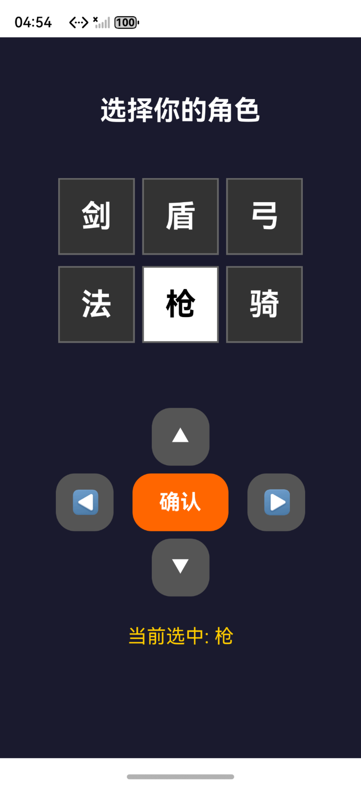
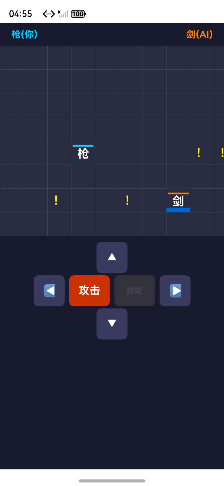

# 网格对战 (Game2)

基于鸿蒙 HarmonyOS ArkTS 开发的网格对战游戏，支持单机 AI 对战和局域网双人联机对战。

## 游戏规则

在 12x8 的网格地图上，双方角色对战，任一方 HP 降为 0 则游戏结束。

### 基础参数

| 参数 | 值 |
|------|-----|
| 地图大小 | 12列 x 8行 |
| 最大生命值 | 300 |
| 普通攻击伤害 | 10 |
| 技能触发 | 命中对方5次（每次+20%蓝色填充，满100%触发） |

### 角色列表

剑 | 盾 | 弓 | 法 | 枪 | 骑

### 技能系统

命中对方时自身格子蓝色填充+20%，填满后随机获得一种技能：

| 技能 | 颜色 | 效果 |
|------|------|------|
| 红色 | #FF0000 | 三行弹幕：当前行及上下各一行，每行发射5个技能弹幕向对方，每个命中25点伤害 |
| 绿色 | #00CC00 | 生命恢复：自身HP+50（上限300） |
| 黄色 | #FFCC00 | 护盾：获得4次护盾，接下来4次被命中不扣血 |
| 紫色 | #9900CC | 隐身：消失2.5秒，出现时若与对方重叠则对方-50HP、自身+10HP、后退一格 |

## 游戏模式

### 单机模式（玩家 vs AI）

主界面点击「开始游戏」→ 选择角色 → 进入对战

AI 行为：
- 移动：每800ms，60%概率追击玩家，40%随机移动
- 攻击：每600ms自动向玩家发射弹幕
- 技能：每500ms检测，有技能立即释放

### 联机模式（玩家 vs 玩家）

主界面点击「局域网联机」→ 创建/加入房间 → 双方选择角色 → 进入对战

联机流程：
1. 一方点击「创建房间」，获取房间号和本机IP
2. 另一方点击「加入房间」，输入房间号和房主IP
3. 双方各自选择角色并确认
4. 房主控制左侧角色（玩家1），加入者控制右侧角色（玩家2）
5. 双方屏幕底部都有完整的方向键+攻击键+技能键
6. 所有操作实时双向同步，双方界面状态一致

### 图片演示
* 角色选择

* 对战界面

* 联机页面

###一次开发，多端部署  
可以适配平板，手机。  
*手机操作方式  
主要通过屏幕上的按键进行操作包括选角色，决斗，移动等  
*平板操作方式  
主要通过直接点击选择角色，操作角色按钮由手机端的正下方转到左右两端，更加适配大屏操作
